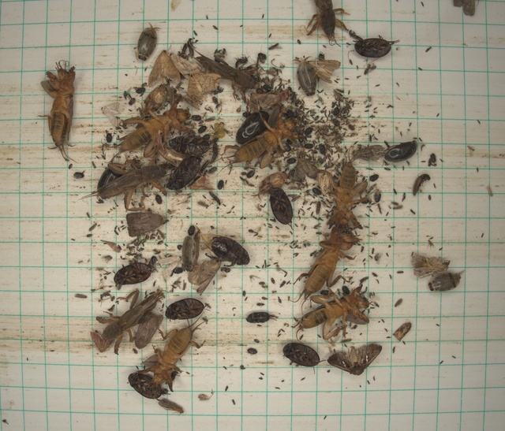

# 🪲 RicePest-30: A Multi-Class Rice Pest Detection Dataset

---

  
  
<em>Example images from the RicePest-30 dataset</em>

---

## 🌾 Overview | 数据集简介

**RicePest-30** is a large-scale, multi-class dataset for **rice pest detection and recognition**, developed to support **AI-based agricultural monitoring and pest management**.  
It contains **8,848 images**, **62,227 annotated instances**, and **30 major rice pest species**, all labeled in **COCO format** using **CVAT v2.45.0**.

RicePest-30 是一个面向智能农业监测与虫害识别的多类水稻害虫检测数据集，包含 **30 种主要害虫**、**8,848 张图像** 和 **62,227 个标注实例**，采用 **COCO 标准格式** 及 **CVAT v2.45.0** 进行高质量标注。

---

## 📷 Data Sources | 数据来源

- **Field Collection (诱虫灯图像)**  
  Collected via UV insect traps (360–400 nm) deployed in Hunan Province (Suining, Taoyuan, Wangcheng).  
  Images captured automatically every 2 hours and uploaded to a remote server.  

- **Web Sources (网络样本)**  
  Publicly available pest images were filtered and retained only if visually consistent with field data.  

- **Lab & Detail Images (实验与细节图)**  
  Includes single-pest and white-background close-ups for fine-grained classification and counting tasks.  

---

## 🧩 Annotation | 标注信息

- **Format:** COCO  
- **Tool:** CVAT v2.45.0  
- **Rule:** Each identifiable pest is annotated, even if slightly blurred or partially occluded.  
  Severely occluded or unrecognizable objects are excluded.  
- **Quality Control:** Dual annotation + cross-checking; 10% of images were reviewed three times.  
- **Total Labels:** 62,227 instances across 30 categories.  

---

## 🐛 Pest Categories | 害虫类别

Examples include:  
*Chilo suppressalis* (二化螟), *Cnaphalocrocis medinalis* (稻纵卷叶螟), *Athetis spp.* (倭委夜蛾),  
*Ostrinia furnacalis* (玉米螟), *Spodoptera frugiperda* (草地贪叶蛾), *Agrotis segetum* (小地老虎), etc.  

| Pest Name | Images | Instances | Pest Name | Images | Instances |
|------------|---------|------------|------------|----------|------------|
| *Chilo suppressalis*  | 2413 | 14835 | *Cnaphalocrocis medinalis* | 1068 | 5218 |
| *Athetis spp.* | 1428 | 4974 | *Plutella xylostella* | 1695 | 4892 |
| *Gryllotalpidae* | 1451 | 3994 | *Trichoptera* | 814 | 2512 |
| *Agrotis segetum* | 1310 | 2849 | *Naranga aenescens* | 696 | 2918 |
| ... | ... | ... | ... | ... | ... |

---

## 📊 Dataset Summary | 数据集统计

| Item | Count | Description |
|------|--------|-------------|
| Pest species | 30 | Major rice pest categories |
| Images | 8,848 | Field, web, and lab images |
| Annotated instances | 62,227 | Bounding boxes in COCO format |
| Format | COCO | Compatible with YOLO, Faster R-CNN, etc. |
| Annotation tool | CVAT v2.45.0 | Dual-annotation with review |

---

## 🔗 Access | 获取方式

RicePest-30 will be publicly available at:  
👉 [**https://github.com/YourName/RicePest-30**](https://github.com/kkb20334-lang/RicePest-30)  
*(Repository under preparation — dataset will be uploaded soon.)*

RicePest-30 数据集将在上述地址开放下载，供科研与教学使用。请遵守 CC BY-NC 4.0 协议。

  © 2025 RicePest-30 Dataset | Licensed under CC BY-NC 4.0 | Created for Agricultural AI Research

